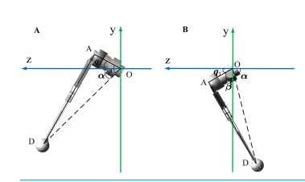
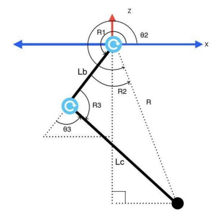
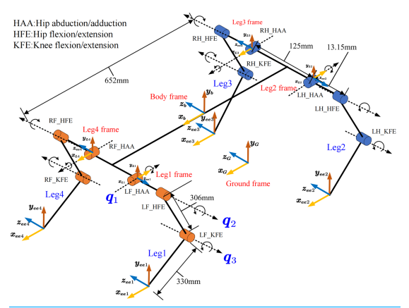

# Doggy

Welcome to Doggy - Your Friendly Quadruped Robot Companion!

## Introduction

Doggy is an open-source quadruped robot designed to serve as a versatile platform for exploring robotics, artificial intelligence, and kinematics. Whether you're a hobbyist, student, or researcher, Doggy provides a customizable and engaging experience in the world of robotics.

## Features

- **Quadruped Design:** Doggy mimics the movements of a dog with its quadruped structure, making it an interactive platform for robotics enthusiasts.

- **Customizable:** The project is highly modular, allowing users to experiment with different hardware configurations, sensors, and control strategies.

- **AI Integration:** Explore the realms of artificial intelligence by implementing reinforcement learning algorithms to control Doggy's movements and behaviors.

- **Inverse Kinematics:** Dive into the fascinating world of robotics control with inverse kinematics, allowing precise control of Doggy's limb movements.

## Inverse Kinematics

Inverse kinematics is a crucial aspect of controlling robotic systems, determining the joint angles needed to achieve a desired end-effector position. In the context of Doggy, inverse kinematics plays a vital role in coordinating the motion of its limbs, enabling smooth and natural movements.

  
  
  

## Contributors
- Your Name - Project Lead
- Contributor 1 - Teammate
